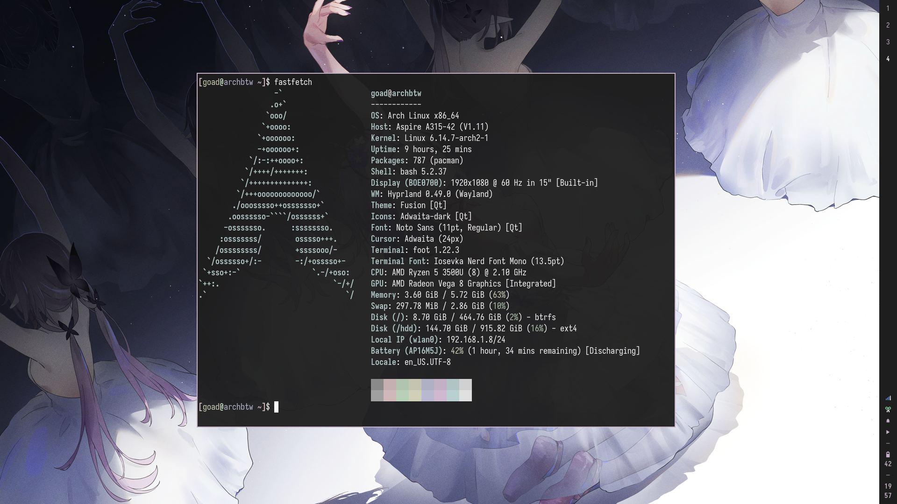

# MY DOTS

## LOOKS

## HOW-TO

1. Install any aur helper you like (`yay`, `paru`, etc)
    * `yay` example : `git clone https://aur.archlinux.org/yay-bin.git && cd yay-bin && makepkg -si`

2. Install required package `./pkglist.txt`
    * Install from the list of package : `yay -S --needed - < pkglist.txt`

3. Build `eww` if needed for the bar. (This is if the binary that on `.local/share/bin/eww` didnt work on your device.)
    * Clone : `git clone https://github.com/elkowar/eww --depth=1`
    * Change dir : `cd eww`
    * Build : `cargo build --release --no-default-features --features=wayland`
    * Copy : `cp target/release/eww $HOME/.local/share/bin/`

4. Copy all the config and local to your own home dir
    * Make the dir if not exist : `mkdir -p $HOME/.config && mkdir -p $HOME/.local`
    * Copy the config : `cp -r .config/ $HOME/.config/`
    * Copy the local : `cp -r .local/ $HOME/.local/`
    * Copy bash stuff : `cp .bashrc $HOME/`
    * Copy bash stuff : `cp .bash_profile $HOME/`
    * Copy inputrc (for case-insensitive autocompletion) : `cp .inputrc $HOME/`

## USAGE

* After reboot login like usual (TTY Login) and after done just type `hypr` and __TADA!__
* FileManager(yazi) : just do `y` on foot terminal and use it like you would use vim(the bindings).
* Terminal(foot) : just do Win+Enter to open foot.
* Menu(rofi-wayland) : just do Win+d to open rofi (which is your app menu)
* Master Menu(rofi-wayland and cusprus) : just do Win+x to open the master menu(shutdown, etc)
* Close: use Win+Shift+q
* Emoji(Win+.), Clipboard(Win+v), Zoom(Win+[+]), NotifHist(Win+n)
* __The rest of the bindings can be seen on .config/hypr/hyprland.conf__
